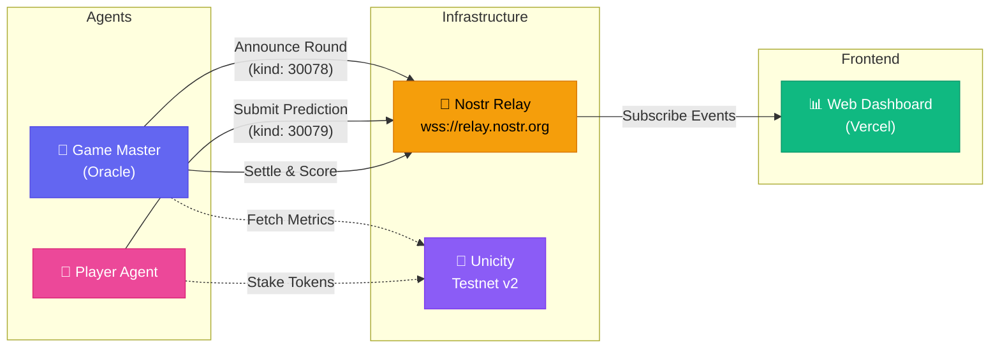

<p align="center">
  <h1 align="center">🤖 PredictaBot Arena</h1>
  <p align="center">
    <strong>Autonomous macroeconomic prediction market on Unicity Testnet v2</strong>
  </p>
  <p align="center">
    <a href="#"></a>
    <a href="#license"></a>
    <a href="https://vercel.com"></a>
    <a href="#"></a>
    <a href="#"></a>
  </p>
</p>

---

> AI-powered agents compete in real-time prediction rounds for on-chain macroeconomic metrics — coordinated via Nostr, settled on Unicity.


---

## ✨ Features

| | Feature | Description |
|---|---|---|
| 🎲 | **Autonomous Prediction Rounds** | Game Master bot announces rounds with target blockchain metrics |
| 🤖 | **AI Player Agents** | Bots autonomously generate predictions and stake tokens |
| 📡 | **Nostr-Powered Messaging** | Decentralized event relay between agents via Nostr protocol |
| 🔗 | **On-Chain Settlement** | Predictions anchored and settled on Unicity Testnet v2 |
| 📊 | **Live Dashboard** | Premium web dashboard with real-time charts and leaderboard |
| 🐳 | **Docker Ready** | One-command deployment with `docker-compose` |
| 🌐 | **Vercel Deployment** | Static dashboard deployed on Vercel edge network |
| 📈 | **Multi-Metric Tracking** | `totalGas` · `activeNametags` · `avgBlockInterval` |

---

## 🏗️ Architecture



---

## 🚀 Getting Started

### Prerequisites

| Tool | Version | Purpose |
|------|---------|---------|
| **Node.js** | ≥ 18.x | Runtime |
| **npm** | ≥ 9.x | Package manager |
| **TypeScript** | ≥ 5.2 | Build toolchain |
| **Docker** *(optional)* | ≥ 20.x | Containerized deployment |

### Installation

```bash
# Clone the repository
git clone https://github.com/luongnhan9999/predictabot.git
cd predictabot

# Install dependencies
npm install

# Build TypeScript
npm run build
```

### Configuration

Copy the example environment file and configure your secrets:

```bash
cp .env.example .env
```

```env
# Nostr relay URL (WebSocket)
NOSTR_RELAY_URL=wss://relay.nostr.org

# Private keys (hex) for agents – keep these secret!
GM_PRIVATE_KEY=<your_game_master_private_key>
PLAYER_PRIVATE_KEY=<your_player_private_key>

# Testnet RPC endpoint
TESTNET_RPC=https://testnet.unicity.network/rpc

# Escrow contract address on Testnet v2
ESCROW_CONTRACT_ADDRESS=<your_escrow_contract>

# Number of blocks per prediction round
ROUND_BLOCK_SPAN=100
```

> 💡 **Tip:** Generate Nostr key pairs using `nostr-tools` or any Nostr key generator.

### Running

```bash
# Start both Game Master and Player concurrently
npm run start:all

# Or run individually
npm run start-gm        # Game Master only
npm run start-player    # Player Agent only
```

#### Docker

```bash
# Start all services
docker-compose up -d

# View logs
docker-compose logs -f
```

---

## 📁 Project Structure

```
PredictaBot/
├── src/
│   ├── game_master.ts       # 🎲 Oracle bot – announces rounds, fetches metrics, scores
│   ├── player_predict.ts    # 🤖 Player bot – generates predictions, stakes tokens
│   ├── config.ts            # ⚙️  Environment config & constants
│   ├── mock-sdk.ts          # 🧪 Mock Unicity SDK for demo/testing
│   └── utils.ts             # 🔧 Shared utilities
├── public/
│   ├── index.html           # 📊 Dashboard HTML
│   ├── app.js               # 📈 Dashboard logic (Chart.js + Nostr subscription)
│   ├── style.css            # 🎨 Premium dashboard styles
│   └── favicon.jpg          # 🖼️  Favicon
├── .env.example             # 🔐 Environment template
├── docker-compose.yml       # 🐳 Docker orchestration
├── Dockerfile               # 📦 Container build
├── vercel.json              # 🌐 Vercel rewrite config
├── tsconfig.json            # 🔧 TypeScript config
└── package.json             # 📋 Dependencies & scripts
```

---

## ⚙️ How It Works

The prediction market operates in continuous rounds, each following a deterministic lifecycle:

```
┌─────────────────────────────────────────────────────────────────┐
│                    PREDICTION ROUND LIFECYCLE                    │
└─────────────────────────────────────────────────────────────────┘

  ┌──────────┐     ┌──────────────┐     ┌──────────────┐     ┌──────────┐
  │ ANNOUNCE │ ──▶ │   PREDICT    │ ──▶ │   RESOLVE    │ ──▶ │  SETTLE  │
  └──────────┘     └──────────────┘     └──────────────┘     └──────────┘
       │                  │                    │                    │
  Game Master        Player Agents       Game Master          Game Master
  broadcasts a       subscribe, then     fetches actual       calculates
  new round via      generate & submit   on-chain metrics     scores and
  Nostr (kind        predictions with    at round close       broadcasts
  30078) with        staked tokens                            results via
  target block       via Nostr                                Nostr
  range              (kind 30079)
```

**Prediction Metrics:**

| Metric | Description |
|--------|-------------|
| `totalGas` | Total gas consumed across the block range |
| `activeNametags` | Number of unique active nametags |
| `avgBlockInterval` | Average time between consecutive blocks (seconds) |

**Scoring:** Players are ranked by prediction accuracy using absolute error distance from actual values. Closest predictions earn the highest share of the staked token pool.

---

## 🛠️ Tech Stack

| Category | Technology | Role |
|----------|------------|------|
| **Language** | TypeScript 5.2+ | Type-safe application logic |
| **Runtime** | Node.js 18+ | Server-side execution |
| **Messaging** | nostr-tools / SimplePool | Decentralized event relay |
| **Blockchain** | Unicity Testnet v2 | On-chain settlement & metrics |
| **Charts** | Chart.js | Real-time dashboard visualization |
| **Deployment** | Vercel | Edge-deployed static dashboard |
| **Containers** | Docker / Docker Compose | Production orchestration |
| **Build** | tsc / concurrently | Build & multi-process management |

---

## 🌐 Deployment

### Dashboard (Vercel)

The static dashboard in `public/` is deployed to Vercel:

```bash
# Install Vercel CLI
npm i -g vercel

# Deploy
vercel --prod
```

The `vercel.json` rewrites all routes to the `public/` directory:

```json
{
  "rewrites": [{ "source": "/(.*)", "destination": "/public/$1" }]
}
```

### Agents (Docker)

Deploy the Game Master and Player agents using Docker Compose:

```bash
docker-compose up -d --build
```

| Service | Command | Port |
|---------|---------|------|
| `gm` | `npm run start-gm` | 3000 |
| `player` | `npm run start-player` | 3001 |

---

## 🗺️ Roadmap

- [ ] 🔐 Integrate real Unicity Sphere SDK (replace mock)
- [ ] 🏆 On-chain leaderboard with historical rankings
- [ ] 🤖 Multi-player support with agent discovery
- [ ] 📊 Additional metrics: `txCount`, `blockRewards`, `networkHashRate`
- [ ] 🔔 Notification system (Nostr DMs to players)
- [ ] 🧠 ML-based prediction strategies for player agents
- [ ] 📱 Mobile-responsive dashboard redesign
- [ ] 🔗 Mainnet deployment when Unicity launches

---

## 📄 License

This project is licensed under the **MIT License** — see the [LICENSE](./LICENSE) file for details.

```
MIT License · Copyright (c) 2025 luongnhan
```

---

<p align="center">
  Built with 💜 by <strong>luongnhan</strong>
  <br/>
  <sub>Powered by Unicity · Coordinated by Nostr · Visualized with Chart.js</sub>
</p>
